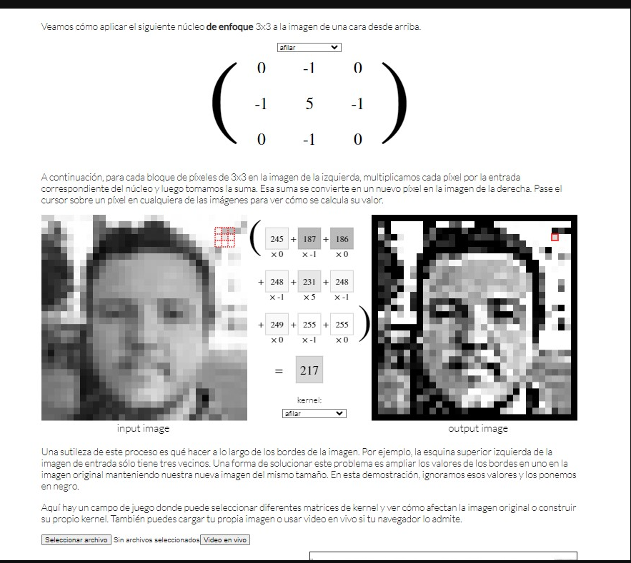

### Nombre: EFRAIN VITORINO MARIN COD: 160337
#### documentacion realizada  en **Markdown**
--- 
deacuerdo al video de [Markdown, Curso Práctico para principiantes y desarrolladores](https://www.youtube.com/watch?v=oxaH9CFpeEE "Youtube")
# *Implementación de Algoritmo para Aplicar Kernels en Imágenes*

------------
**Descripción del Proyecto**
<p>
Este proyecto tiene como objetivo implementar un algoritmo que aplique kernels a una imagen cualquiera. El proceso y los resultados serán presentados al docente en clase, y se incluirá un informe detallado describiendo cada paso y los resultados obtenidos.
</p>

- segun referencia brindada por el profesor: [Image Kernels](https://setosa.io/ev/image-kernels/ "Image Kernels")

  - **imagen de referencia**
    
- **Requisitos Previos**
Necesitarás tener instaladas las librerías ``numpy`` y 
 ``opencv-python``. Puedes instalarlas usando pip: 
 ```bash
 pip install numpy opencv-python
``` 
y ejecutar en su **Sypider**
## caso B 😢 ( sino funciona o no ejecuta el codigo )
- utilizar **A naconda**
deacuerdo al video de [Anaconda navigaitor](https://www.anaconda.com/download "Anaconda")
- **demostracion de uso** despues de instalar ejecutar **Anaconda**
**demostracion**

esto abrira de forma automatica **Spyder**
## Ejemplo de clase 
ejemplo de codigo en python 
```python
# -*- coding: utf-8 -*-
"""
Created on Wed May 29 10:32:36 2024

@author: DocenteDAII
"""
import numpy as np
import matplotlib.pyplot as plt

#leer la imagen
imagen = plt.imread("d:/img.jpg")/255

#escala de grises
alto,ancho,_=imagen.shape
imagenG=np.zeros((alto,ancho))
for i in range(alto):
    for j in range(ancho):
       pix=(imagen[i,j,0]+imagen[i,j,0]+imagen[i,j,0])/3 
       imagenG[i,j]=pix
       
#escala de grises
alto,ancho,columna=imagen.shape
imagenI=np.zeros((alto,ancho,columna))
for i in range(alto):
    for j in range(ancho):
       imagenI[i,j,0]=1-imagen[i,j,0] 
       imagenI[i,j,1]=1-imagen[i,j,1]  
       imagenI[i,j,2]=1-imagen[i,j,2]  
       
#escala de brillos

imagenB=np.zeros((alto,ancho,columna))
for i in range(alto):
    for j in range(ancho):
        imagenB[i,j]=imagen[i,j]-0.5
#mostrar la imagen
plt.imshow(imagenB,cmap="gray")
plt.axis("off")
```