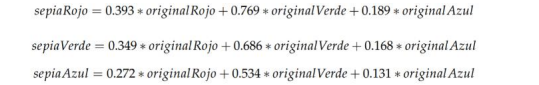
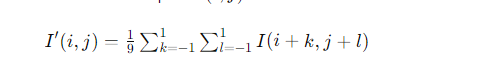
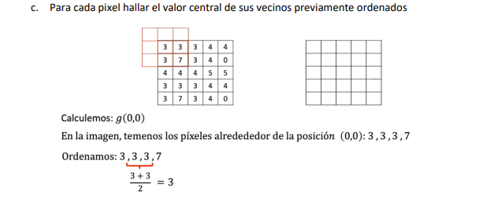
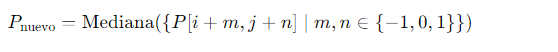
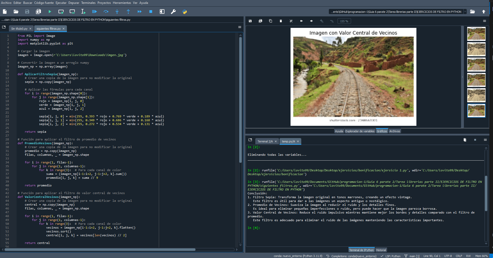
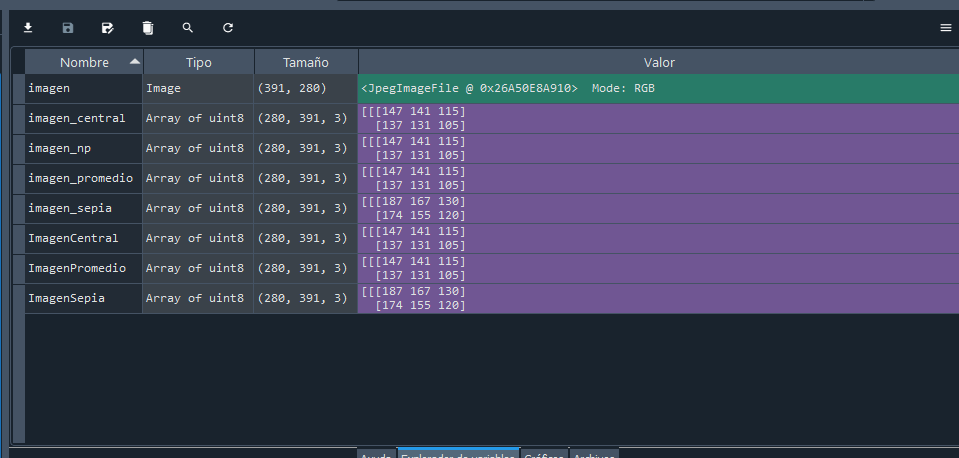
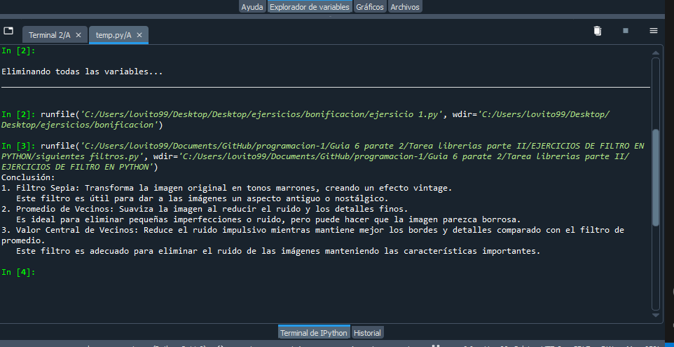

# Trabajo de bonificacion 
## Nombre: Efrain Vitorino marin Codigo: 160337
- # 👀 Implementar los siguientes filtros📷 
  * Modificando los valores de los canales de cada pixel y si es necesario
redondear los valores resultantes aplicar la siguiente fórmula
## 1. Filtro Sepia
 * condicion

     
- **introduccion**  para el caso **(A)**
      - El filtro sepia convierte una imagen de color a tonos sepia, que son tonos marrones claros que imitan las fotografías antiguas. Este filtro se logra mediante una transformación lineal de los valores de los canales de color **(rojo, verde y azul)**.
     * Las fórmulas para convertir un píxel de RGB a sepia son
       ```
       R' = 0.393 * R + 0.769 * G + 0.189 * B
       G' = 0.349 * R + 0.686 * G + 0.168 * B
       B' = 0.272 * R + 0.534 * G + 0.131 * B
    
       ```
     * R,G,B son los valores originales de los canales rojo, verde y azul.
     * 𝑅′,𝐺′,𝐵′ son los nuevos valores de estos canales, después de aplicar el filtro.
     * Esta transformación asegura que los tonos de la imagen se ajusten para obtener el efecto sepia, que es característico de las fotografías antiguas.
- Fundamento
<p> El filtro sepia se basa en una transformación lineal que combina los canales de color de una manera específica para lograr una apariencia vintage. La transformación se aplica a cada píxel individualmente. <p>

### Ejemplo:
Si un píxel tiene los valores R = 100, G = 150, B = 200, los nuevos valores después de aplicar el filtro sepia serían:
   ```
   R' = 0.393 * 100 + 0.769 * 150 + 0.189 * 200 = 173.85
   G' = 0.349 * 100 + 0.686 * 150 + 0.168 * 200 = 154.7
   B' = 0.272 * 100 + 0.534 * 150 + 0.131 * 200 = 120.9
   ```
   Estos valores se redondean y se limitan al rango de 0 a 255.
   ## Código Aplicado:
   importar estas librerias
   ```python
   from PIL import Image
   import numpy as np
   import matplotlib.pyplot as plt
   ```
   **python**
   ```python
   def aplicar_filtro_sepia(imagen_np):
    sepia = np.copy(imagen_np)
    for i in range(imagen_np.shape[0]):
        for j in range(imagen_np.shape[1]):
            rojo = imagen_np[i, j, 0]
            verde = imagen_np[i, j, 1]
            azul = imagen_np[i, j, 2]
            
            sepia[i, j, 0] = min(255, 0.393 * rojo + 0.769 * verde + 0.189 * azul)
            sepia[i, j, 1] = min(255, 0.349 * rojo + 0.686 * verde + 0.168 * azul)
            sepia[i, j, 2] = min(255, 0.272 * rojo + 0.534 * verde + 0.131 * azul)
    
    return sepia
```
## 2. Filtro de Promedio de Vecinos
- El filtro de promedio de vecinos suaviza una imagen reemplazando cada píxel con el promedio de los valores de los píxeles vecinos en una ventana de 3×3 . La fórmula matemática para calcular el nuevo valor del píxel 𝐼(𝑖,𝑗) es:

    
    Donde 𝐼(𝑖,𝑗)I(i,j) es el valor del píxel en la posición (𝑖,𝑗) y 𝐼′(𝑖,𝑗) es el nuevo valor del píxel después de aplicar el filtro.
    * Este filtro es un tipo de filtro de suavizado lineal que reduce las variaciones abruptas en la imagen (ruido) promediando los valores de los píxeles en una vecindad de 3×3. Es útil para eliminar ruido gaussiano y obtener una imagen más suave.
- son los valores de los píxeles vecinos (incluyendo el propio).
  * python
  ```python
  def PromedioVesinos(imagen_np):
    promedio = np.copy(imagen_np)
    filas, columnas, _ = imagen_np.shape
    
    for i in range(1, filas-1):
        for j in range(1, columnas-1):
            for k in range(3):  # Para cada canal de color
                suma = (imagen_np[i-1:i+2, j-1:j+2, k].sum())
                promedio[i, j, k] = suma // 9
    
    return promedio
  ```
## 3. Filtro de Valor Central de Vecinos
El filtro de valor central de vecinos reemplaza cada píxel por el valor central (mediana) de los valores de sus píxeles vecinos en una ventana de 3×3. La fórmula para el nuevo valor del píxel es:
 
 - expresada de forma genra seria 
  
  Donde la mediana es el valor central de los 9 píxeles ordenados.
  - python
  ```python
  def ValorCentralVesinos(imagen_np):
    central = np.copy(imagen_np)
    filas, columnas, _ = imagen_np.shape
    
    for i in range(1, filas-1):
        for j in range(1, columnas-1):
            for k in range(3):  # Para cada canal de color
                vecinos = imagen_np[i-1:i+2, j-1:j+2, k].flatten()
                vecinos.sort()
                central[i, j, k] = vecinos[len(vecinos) // 2]
    
    return central
```
## Conclusión
Cada uno de estos filtros transforma la imagen de una manera específica:

- **Filtro Sepia:** Transforma la imagen a tonos marrones, creando un efecto vintage.
- **Promedio de Vecinos:** Suaviza la imagen, reduciendo el ruido pero también los detalles finos.
- **Valor Central de Vecinos:** Reduce el ruido impulsivo mientras mantiene los bordes y detalles mejor que el filtro de promedio.
```python
print("Conclusión:")
print("1. Filtro Sepia: Transforma la imagen original en tonos marrones, creando un efecto vintage.")
print("   Este filtro es útil para dar a las imágenes un aspecto antiguo o nostálgico.")
print("2. Promedio de Vecinos: Suaviza la imagen al reducir el ruido y los detalles finos.")
print("   Es ideal para eliminar pequeñas imperfecciones o ruido, pero puede hacer que la imagen parezca borrosa.")
print("3. Valor Central de Vecinos: Reduce el ruido impulsivo mientras mantiene mejor los bordes y detalles comparado con el filtro de promedio.")
print("   Este filtro es adecuado para eliminar el ruido de las imágenes manteniendo las características importantes.")
```
### Ejecucion 

### Explorador de variables

### Terminal 

# codigo completo en python usando spyder y sus librerias 
```python
from PIL import Image
import numpy as np
import matplotlib.pyplot as plt

# Cargar la imagen
imagen = Image.open(r'C:\Users\lovito99\Downloads\imgen.jpg')

# Convertir la imagen a un arreglo numpy
imagen_np = np.array(imagen)

def AplicarFiltroSepia(imagen_np):
    # Crear una copia de la imagen para no modificar la original
    sepia = np.copy(imagen_np)
    
    # Aplicar las fórmulas para cada canal
    for i in range(imagen_np.shape[0]):
        for j in range(imagen_np.shape[1]):
            rojo = imagen_np[i, j, 0]
            verde = imagen_np[i, j, 1]
            azul = imagen_np[i, j, 2]
            
            sepia[i, j, 0] = min(255, 0.393 * rojo + 0.769 * verde + 0.189 * azul)
            sepia[i, j, 1] = min(255, 0.349 * rojo + 0.686 * verde + 0.168 * azul)
            sepia[i, j, 2] = min(255, 0.272 * rojo + 0.534 * verde + 0.131 * azul)
    
    return sepia

# Función para aplicar el filtro de promedio de vecinos
def PromedioVesinos(imagen_np):
    # Crear una copia de la imagen para no modificar la original
    promedio = np.copy(imagen_np)
    filas, columnas, _ = imagen_np.shape
    
    for i in range(1, filas-1):
        for j in range(1, columnas-1):
            for k in range(3):  # Para cada canal de color
                suma = (imagen_np[i-1:i+2, j-1:j+2, k].sum())
                promedio[i, j, k] = suma // 9
    
    return promedio

# Función para aplicar el filtro de valor central de vecinos
def ValorCentralVesinos(imagen_np):
    # Crear una copia de la imagen para no modificar la original
    central = np.copy(imagen_np)
    filas, columnas, _ = imagen_np.shape
    
    for i in range(1, filas-1):
        for j in range(1, columnas-1):
            for k in range(3):  # Para cada canal de color
                vecinos = imagen_np[i-1:i+2, j-1:j+2, k].flatten()
                vecinos.sort()
                central[i, j, k] = vecinos[len(vecinos) // 2]
    
    return central

# Aplicar el filtro sepia
ImagenSepia = AplicarFiltroSepia(imagen_np)
# Aplicar el filtro de promedio de vecinos
ImagenPromedio = PromedioVesinos(imagen_np)
# Aplicar el filtro de valor central de vecinos
ImagenCentral = ValorCentralVesinos(imagen_np)

# Mostrar la imagen con el promedio de vecinos
plt.imshow(ImagenPromedio)
plt.title("Imagen con Promedio de Vecinos")
plt.axis('off')
plt.show()

# Mostrar la imagen con el filtro sepia
plt.imshow(ImagenSepia)
plt.title("Imagen con Filtro Sepia")
plt.axis('off')
plt.show()

# Mostrar la imagen con el valor central de vecinos
plt.imshow(ImagenCentral)
plt.title("Imagen con Valor Central de Vecinos")
plt.axis('off')
plt.show()

# Conclusión
print("Conclusión:")
print("1. Filtro Sepia: Transforma la imagen original en tonos marrones, creando un efecto vintage.")
print("   Este filtro es útil para dar a las imágenes un aspecto antiguo o nostálgico.")
print("2. Promedio de Vecinos: Suaviza la imagen al reducir el ruido y los detalles finos.")
print("   Es ideal para eliminar pequeñas imperfecciones o ruido, pero puede hacer que la imagen parezca borrosa.")
print("3. Valor Central de Vecinos: Reduce el ruido impulsivo mientras mantiene mejor los bordes y detalles comparado con el filtro de promedio.")
print("   Este filtro es adecuado para eliminar el ruido de las imágenes manteniendo las características importantes.")
```


