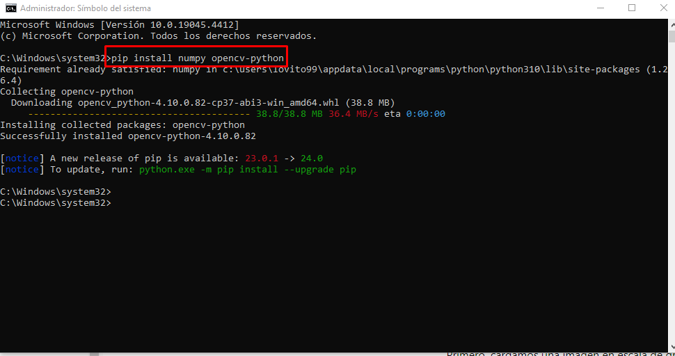
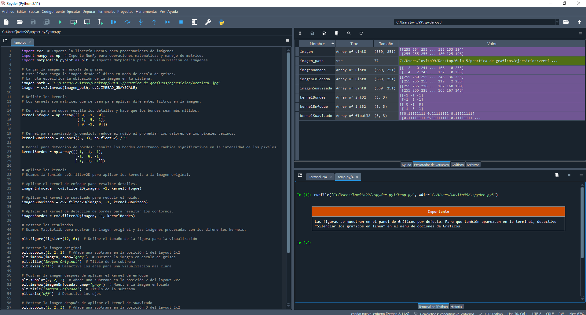
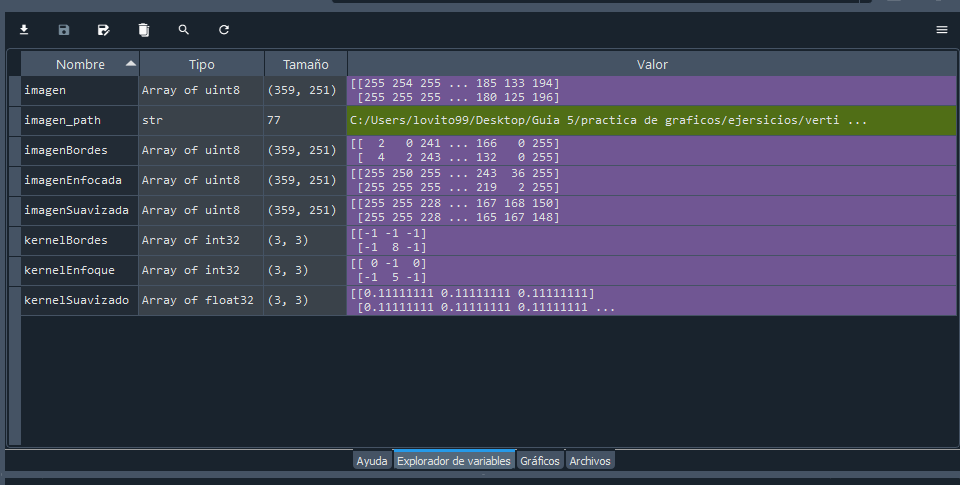
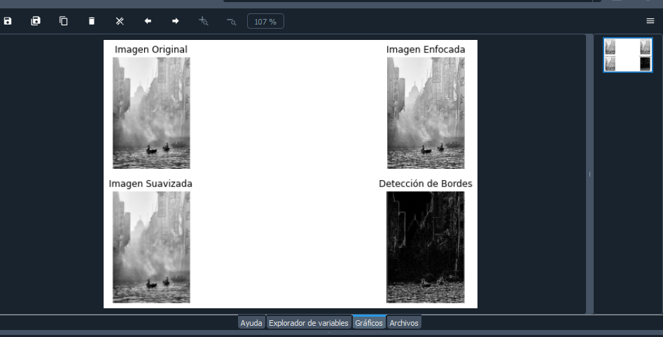

### Efrain Vitorino Marin Cod: **160337**
## Implementación de un Algoritmo para Aplicar Kernels en una Imagen

- **En este ejemplo, implementaremos un algoritmo en Python para aplicar núcleos (kernels) a una imagen. Utilizaremos la librería OpenCV para manejar las imágenes. El algoritmo se puede personalizar para aplicar diferentes tipos de kernels, como enfoque, desenfoque y realce de bordes.**
-  ### ¿Qué es un Kernel?:
   * Un kernel es una matriz pequeña (generalmente de tamaño 3x3, 5x5, etc.) que se utiliza para transformar una imagen mediante una operación llamada convolución. En el contexto de imágenes, un kernel se mueve a través de cada píxel de la imagen y realiza operaciones basadas en los valores de los píxeles dentro de su vecindad definida por el tamaño del kernel.
 * Aplicación:
Este kernel aplica una fuerte ponderación positiva al píxel central y ponderaciones negativas a sus vecinos inmediatos, lo que resulta en una imagen más nítida.
* Conclucion:
Mejora la nitidez de la imagen y realza los bordes.

---------------
Visualización:

Supongamos que aplicamos este kernel a una imagen:


Imagen Original: La imagen tal cual se carga.
Imagen Procesada: Después de aplicar el kernel de enfoque, los bordes y detalles se vuelven más prominentes.

## Ejemplo 
imagen de ejemplo
```
1 2 3
4 5 6
7 8 9
```
Kernel de Enfoque 3x3
```  
 0 -1  0
-1  5 -1
 0 -1  0
 ```
* Multiplicamos cada valor del kernel por el valor correspondiente del píxel:
```
 0*1 + (-1)*2 +  0*3 +
(-1)*4 +  5*5 + (-1)*6 +
 0*7 + (-1)*8 +  0*9
```
 _______________________
  - Requisitos Previos
  #### Antes de comenzar, asegúrate de tener instaladas las librerías ``numpy`` y ``opencv-python`` Puedes instalarlas usando pip:

  ```bash
  pip install numpy opencv-python
  ```
- **instalacion**

 
 #### en caso de no funcionar 😪
 Utilizando **Anaconda**  se proce a realizar las modificaciones 
 - Busca la variable Path en la sección Variables del sistema y edítala.

Agrega las siguientes rutas, si no están ya presentes:
```
C:\Users\lovito99\anaconda3
C:\Users\lovito99\anaconda3\Scripts
C:\Users\lovito99\anaconda3\Library\bin
conda install matplotlib
```
# Explicacion del codigo 🖥️
- **1. Empesamos con la importacion de los modulos**
 ```
 import cv2
import numpy as np
```
Es el módulo de **OpenCV**, una biblioteca muy popular para el procesamiento de imágenes.
- **numpy:** 
     #Es una biblioteca fundamental para el cálculo numérico en Python, utilizada aquí para manejar matrices (o arrays).
- **2.**  **Definición de la Función AplicarKernel**
Esta función toma como entrada la ruta de una imagen (imagen_path) y un filtro de procesamiento (o kernel) (kernel).

``` python
def AplicarKernel(imagen_path, kernel):
```
- **3.** **Cargar la Imagen en Escala de Grises:**
  - `cv2.imread`: Carga la imagen desde la ruta especificada.
  - `cv2.IMREAD_GRAYSCALE`: Lee la imagen en modo escala de grises.
```python 
  imagen = cv2.imread(imagen_path, cv2.IMREAD_GRAYSCALE)
```

### Ejemplos de Kernels Comunes
  - * * ***
    * Kernel de Enfoque
    Este kernel resalta los detalles en la imagen, haciendo los bordes más nítidos.
       ```
       KernelEnfoque = np.array([[ 0, -1,  0], 
                           [-1,  5, -1], 
                           [ 0, -1,  0]])
       ```
       * Aplicación:
Este kernel aplica una fuerte ponderación positiva al píxel central y ponderaciones negativas a sus vecinos inmediatos, lo que resulta en una imagen más nítida.
        * conclucion :
Mejora la nitidez de la imagen y realza los bordes.

Visualización:
- Imagen Original: La imagen tal cual se carga.
- Imagen Procesada: Después de aplicar el kernel de enfoque, los bordes y detalles se vuelven más prominentes.


- * **Kernel de Suavizado (Promedio):**
Este kernel suaviza la imagen reduciendo el ruido.
 ```
 KernelSuavizado = np.ones((3, 3), np.float32) / 9
```
  * Aplicación:
Resalta los bordes detectando diferencias significativas en la intensidad de los píxeles.
Efecto:
Los bordes en la imagen se vuelven muy prominentes, lo que es útil para la detección de contornos.
* Visualización:
Al aplicar este kernel, la imagen muestra claramente los bordes:

* Imagen Original: Contornos no destacados.
* Imagen Procesada: Contornos y bordes destacados.

### Ejecucion del codigo en Spyder
 **Spyder captura de panttalla**
 ``runfile('C:/Users/lovito99/.spyder-py3/temp.py', wdir='C:/Users/lovito99/.spyder-py3')``
 

**Explorador variables**

**Graficos**
resultante de lña imagen 
* imagen original
* imagen suvizada
* imagen enfocada
* deteccion de bordes

## codigo en **python**
```python
import cv2  # Importa la librería OpenCV para procesamiento de imágenes
import numpy as np  # Importa NumPy para operaciones matemáticas y manejo de matrices
import matplotlib.pyplot as plt  # Importa Matplotlib para la visualización de imágenes

# Cargar la imagen en escala de grises
# Esta línea carga la imagen desde el disco en modo de escala de grises.
# La ruta especifica la ubicación de la imagen en tu sistema.
imagen_path = 'C:/Users/lovito99/Desktop/Guia 5/practica de graficos/ejersicios/vertical.jpg'
imagen = cv2.imread(imagen_path, cv2.IMREAD_GRAYSCALE)

# Definir los kernels
# Los kernels son matrices que se usan para aplicar diferentes filtros en la imagen.

# Kernel para enfoque: resalta los detalles y hace que los bordes sean más nítidos.
kernelEnfoque = np.array([[ 0, -1,  0], 
                          [-1,  5, -1], 
                          [ 0, -1,  0]])

# Kernel para suavizado (promedio): reduce el ruido al promediar los valores de los píxeles vecinos.
kernelSuavizado = np.ones((3, 3), np.float32) / 9

# Kernel para detección de bordes: resalta los bordes detectando cambios significativos en la intensidad de los píxeles.
kernelBordes = np.array([[-1, -1, -1], 
                         [-1,  8, -1], 
                         [-1, -1, -1]])

# Aplicar los kernels
# Usamos la función cv2.filter2D para aplicar los kernels a la imagen original.

# Aplicar el kernel de enfoque para resaltar detalles.
imagenEnfocada = cv2.filter2D(imagen, -1, kernelEnfoque)

# Aplicar el kernel de suavizado para reducir el ruido.
imagenSuavizada = cv2.filter2D(imagen, -1, kernelSuavizado)

# Aplicar el kernel de detección de bordes para resaltar los contornos.
imagenBordes = cv2.filter2D(imagen, -1, kernelBordes)

# Mostrar los resultados
# Usamos Matplotlib para mostrar la imagen original y las imágenes procesadas con los diferentes kernels.

plt.figure(figsize=(12, 6))  # Define el tamaño de la figura para la visualización

# Mostrar la imagen original
plt.subplot(2, 2, 1)  # Añade una subtrama en la posición 1 del layout 2x2
plt.imshow(imagen, cmap='gray')  # Muestra la imagen en escala de grises
plt.title('Imagen Original')  # Título de la subtrama
plt.axis('off')  # Desactiva los ejes para una visualización más clara

# Mostrar la imagen después de aplicar el kernel de enfoque
plt.subplot(2, 2, 2)  # Añade una subtrama en la posición 2 del layout 2x2
plt.imshow(imagenEnfocada, cmap='gray')  # Muestra la imagen enfocada
plt.title('Imagen Enfocada')  # Título de la subtrama
plt.axis('off')  # Desactiva los ejes

# Mostrar la imagen después de aplicar el kernel de suavizado
plt.subplot(2, 2, 3)  # Añade una subtrama en la posición 3 del layout 2x2
plt.imshow(imagenSuavizada, cmap='gray')  # Muestra la imagen suavizada
plt.title('Imagen Suavizada')  # Título de la subtrama
plt.axis('off')  # Desactiva los ejes

# Mostrar la imagen después de aplicar el kernel de detección de bordes
plt.subplot(2, 2, 4)  # Añade una subtrama en la posición 4 del layout 2x2
plt.imshow(imagenBordes, cmap='gray')  # Muestra la imagen con bordes detectados
plt.title('Detección de Bordes')  # Título de la subtrama
plt.axis('off')  # Desactiva los ejes

# Muestra todas las subtramas en la figura
plt.show()
```
